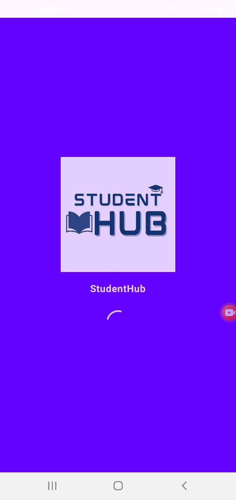

🧠 StudentHub Compose
🎯 Overview

StudentHub Compose is a modern Android application built with Jetpack Compose and Kotlin, designed to manage students, faculties, and user profiles in a clean and efficient way.
It offers a simple yet elegant UI with a top app bar, bottom navigation, and splash screen for a smooth app experience.

🚀 Features

🧑‍🏫 Manage students and faculties easily

🔐 Login and logout with authentication flow

💬 Logout confirmation dialog

🏠 Auto-navigation to HomeScreen for logged-in users

⚡ Splash screen with StudentHub logo

🎨 Built entirely with Jetpack Compose (Material 3)

📱 Fully responsive for modern Android devices

🧩 Tech Stack

Language: Kotlin

UI: Jetpack Compose, Material 3

Architecture: MVVM

Dependency Injection: Hilt

Navigation: Jetpack Compose Navigation

Serialization: Kotlinx Serialization

🖼️ Screenshots (optional)

  
  

⚙️ How to Run

Clone the repository:

git clone https://gitlab.com/bunyod22/studenthub-compose.git

Open the project in Android Studio.

Sync Gradle and run on an emulator or physical device.

👨‍💻 Author

Bunyodjon Raxmonov
📍 GitLab Profile

💬 Passionate about Android development with Kotlin and Jetpack Compose.